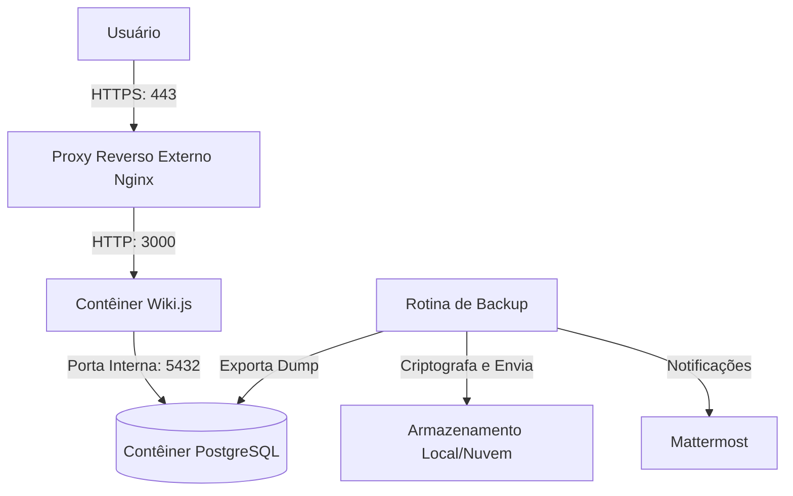

# CDC Wiki (Wiki.js Infrastructure)

Este repositório armazena a infraestrutura conteinerizada e as diretrizes de implantação da base de conhecimento da CDC, baseada no Wiki.js.

[](https://js.wiki/)
[](https://www.postgresql.org/)
[](LICENSE)
[](#)

---

## Arquitetura

O sistema opera com o Wiki.js como frontend de documentação e o PostgreSQL como banco de dados relacional. Toda a infraestrutura é orquestrada via Docker Compose.



---

## Estrutura de Diretórios

```text
/
├── docs/                      # Documentação técnica padronizada
│   ├── diretrizes_documentacao.md
│   ├── estrategia_execucao.md
│   ├── migration_guide.md
│   ├── ajuda_infra.md
│   ├── postmortem.md
│   ├── troubleshooting.md
│   ├── politica_backup.md
│   └── prompt_ia.md
├── Dockerfile                 # Define a imagem herdada e compilada
├── docker-compose.yml         # Orquestrador de serviços e redes
├── .env.example               # Modelo das variáveis de ambiente públicas
├── .gitignore                 # Arquivos ignorados pelo Git (dados, .env)
└── ajuda.txt                  # Guia rápido de portas e inicialização local
```

---

## Requisitos Mínimos

| Componente | Versão Mínima | Finalidade |
| :--- | :---: | :--- |
| Docker | 20.10+ | Runtime de execução de contêineres. |
| Docker Compose | 2.0+ | Orquestração simplificada dos serviços. |
| PostgreSQL | 16.4 | Motor de banco de dados para armazenamento persistente. |

---

## Configuração do Ambiente

1. Copie o arquivo de exemplo para criar a sua configuração local:
   ```bash
   cp .env.example .env
   ```
2. Abra o arquivo `.env` gerado e configure suas credenciais de banco e do Mattermost:
   - A senha do banco de dados (`DB_PASS`) deve ser forte e única.
   - O endereço de webhook do Mattermost (`MATTERMOST_WEBHOOK_URL`) deve ser tratado como segredo absoluto. Nunca envie este arquivo `.env` para o Git.

---

## Inicialização Rápida

1. **Compilar e subir os serviços:**
   ```bash
   docker compose up -d --build
   ```
2. **Verificar o status dos contêineres e healthcheck:**
   ```bash
   docker compose ps
   ```
3. **Validar acesso HTTP local:**
   ```bash
   curl -I http://localhost:3000
   ```
4. **Verificar os logs de boot do sistema:**
   ```bash
   docker compose logs -f wiki
   ```
5. **Realizar o setup primário:**
   Acesse no navegador `http://localhost:3000` (ou o domínio mapeado da VPS) e siga o assistente de instalação do Wiki.js para cadastrar a conta de administrador primária.

---

## Cheat Sheet (Comandos Rápidos)

- **Subir contêineres em segundo plano:** `docker compose up -d`
- **Derrubar e parar os serviços:** `docker compose down`
- **Visualizar logs em tempo real:** `docker compose logs -f`
- **Acessar o terminal interativo do Wiki.js:** `docker compose exec wiki sh`
- **Acessar o terminal do banco de dados (PostgreSQL):** `docker compose exec db psql -U wiki -d wikidb`
- **Testar disparo de notificações no Mattermost:**
  ```bash
  export $(grep -v '^#' .env | xargs)
  curl -X POST -H "Content-Type: application/json" -d '{"text":"Teste de conexao."}' "$MATTERMOST_WEBHOOK_URL"
  ```

---

## Documentação Complementar

- [Diretrizes de documentação](file:///home/vier/Documentos/Code/CDC/wiki/docs/diretrizes_documentacao.md) — Regras de criação, manutenção, revisão e evolução técnica.
- [Estratégia de execução](file:///home/vier/Documentos/Code/CDC/wiki/docs/estrategia_execucao.md) — Fluxo de trabalho de branches (Gitflow), ambientes de testes e rollback.
- [Guia de migração](file:///home/vier/Documentos/Code/CDC/wiki/docs/migration_guide.md) — Configurações SSH seguras, diagnósticos do servidor VPS e movimentação de dados.
- [Ajuda de infraestrutura](file:///home/vier/Documentos/Code/CDC/wiki/docs/ajuda_infra.md) — Arquitetura de rede docker, mapeamento de portas e webhooks do Mattermost.
- [Post-mortem](file:///home/vier/Documentos/Code/CDC/wiki/docs/postmortem.md) — Roteiro de análise de incidentes crítico blameless (sem procurar culpados).
- [Troubleshooting](file:///home/vier/Documentos/Code/CDC/wiki/docs/troubleshooting.md) — Guia de depuração rápida para contêineres, erros de banco de dados, emails e redes.
- [Política de backup](file:///home/vier/Documentos/Code/CDC/wiki/docs/politica_backup.md) — Modelo 3-2-1, script automatizado e guia de restore do banco de dados.
- [Contexto para IA](file:///home/vier/Documentos/Code/CDC/wiki/docs/prompt_ia.md) — Prompt unificado de contexto de projeto para assistentes de Inteligência Artificial.

---

## Importância da Documentação

A documentação técnica é viva e representa a verdade operacional do nosso ecossistema. Mantê-la atualizada é responsabilidade técnica essencial de todos os integrantes do projeto. Atualize as diretrizes e manuais sempre que realizar mudanças estruturais ou de topologia.
