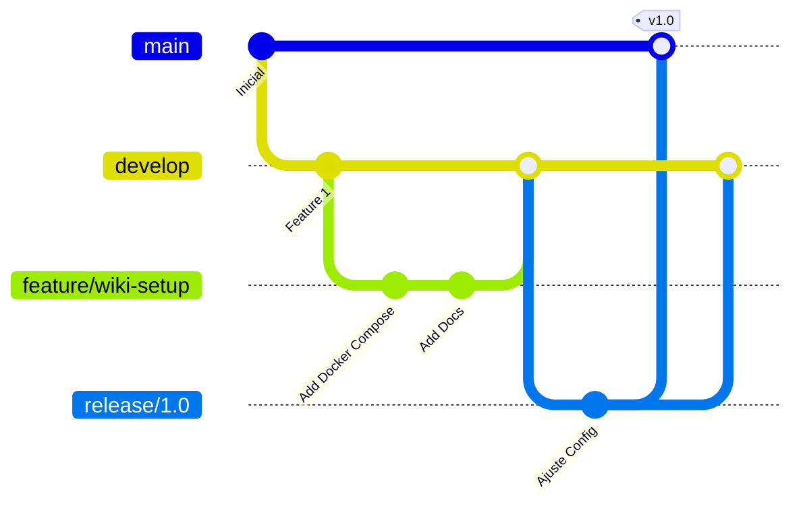

# Estratégia de Execução (CDC Wiki)

Este documento detalha o fluxo de desenvolvimento, gerenciamento de branches, ciclos de deploy e rollback para o projeto Wiki.js da CDC.

---

## Visão geral

- **Nome do Projeto:** CDC Wiki
- **Objetivo Principal:** Centralizar a base de conhecimento interna da ONG, fornecendo uma plataforma rápida, segura e amigável para edição de documentação via Markdown, gráficos e editores visuais.
- **Componentes Principais:**
  - Aplicação Wiki.js (Node.js) rodando em contêiner Docker.
  - Banco de Dados PostgreSQL (16.4-alpine) para persistência de dados.
- **Tecnologias Utilizadas:** Node.js, PostgreSQL, Docker, Docker Compose, Nginx (Proxy Reverso externo), Mattermost (Alertas).
- **Integração com Mattermost:** Notificações automáticas de deploy e status de pipelines enviadas para o canal `#alertas-infra`.

---

## Organização dos repositórios

O projeto CDC Wiki é mantido em um único repositório estruturado da seguinte forma:
- `/` (Raiz): Arquivos de orquestração Docker (`docker-compose.yml`, `Dockerfile`), variáveis públicas (`.env.example`), arquivos de exclusão (`.gitignore`) e guia operacional (`ajuda.txt`).
- `/docs/`: Documentação técnica padronizada do projeto.
- `/data/`: Diretório local do host reservado para persistência de dados (ignorado pelo Git).
  - `/data/db/`: Arquivos do banco PostgreSQL.

---

## Estratégia de branches

Adotamos uma versão simplificada do Gitflow para gerenciar o ciclo de vida do código:



### Branches e Finalidades:
- **`main`:** Contém o código estável de produção. Todo commit nesta branch representa uma release testada e homologada.
- **`develop`:** Branch de integração contínua para novas funcionalidades. Recebe merges das branches de feature.
- **`feature/*`:** Criadas a partir de `develop` para desenvolver melhorias ou correções específicas. Devem ser excluídas após o merge via Pull Request.
- **`release/*`:** Criadas a partir de `develop` para preparação de uma nova release (correções de bugs de homologação).
- **`hotfix/*`:** Criadas diretamente de `main` para correções críticas urgentes de produção.

### Regras de Merge e Versão:
- Todo merge para `develop` ou `main` deve ser precedido por um Pull Request revisado por pelo menos um colega.
- Versões são taggeadas na `main` utilizando Versionamento Semântico (ex: `v1.0`).
- Atualizações de documentação técnica devem subir no mesmo Pull Request do código associado.

---

## Ambientes

Trabalhamos com os seguintes ambientes lógicos:

### 1. Desenvolvimento (Ambiente Local)
- **Objetivo:** Desenvolvimento de novos recursos, testes locais e validações rápidas.
- **URL/Acesso:** `http://localhost:3009`
- **Banco de Dados:** PostgreSQL rodando no Docker local com dados fictícios.
- **Segurança:** Não utilizar dumps de produção sem prévia anonimização de dados de usuários.

### 2. Homologação / Staging
- **Objetivo:** Validar atualizações de infraestrutura e migrações de dados antes de ir para produção.
- **URL/Acesso:** `http://<HOMOL_SERVER_IP>:3009` (ou via subdomínio privado de testes).
- **Banco de Dados:** Instância isolada do PostgreSQL carregando um dump higienizado de produção.
- **Notificações:** Alertas de build e deploy no Mattermost direcionados para `#alertas-homol`.

### 3. Produção
- **Objetivo:** Ambiente real de uso da ONG.
- **URL/Acesso:** `https://wiki.<DOMINIO_DO_PROJETO>`
- **Banco de Dados:** Instância PostgreSQL de alta performance com persistência de dados local segura em `./data/db`.
- **Notificações:** Alertas críticos de infraestrutura, backup e indisponibilidade direcionados para `#alertas-infra`.

---

## Fluxos funcionais importantes

O ciclo de vida operacional do Wiki.js possui três etapas críticas:

### 1. Fluxo de Instalação e Inicialização Primária
Ocorre no primeiro boot do contêiner:
1. O Docker Compose sobe o contêiner `db`.
2. O contêiner `wiki` inicia e aguarda o banco estar `healthy` (healthcheck do PostgreSQL).
3. Ao detectar o banco vazio, o Wiki.js roda suas migrations SQL nativas para estruturar as tabelas.
4. O administrador acessa a interface web pela primeira vez e cria a conta root de administrador.

### 2. Fluxo de Edição e Armazenamento
1. O usuário edita uma página via interface web (Markdown ou Editor Visual).
2. O conteúdo textual e metadados são salvos diretamente no banco de dados PostgreSQL.
3. Se houver upload de imagens ou arquivos, eles são armazenados como blobs no banco de dados (padrão do Wiki.js) ou enviados para um storage externo configurado.

### 3. Fluxo de Autenticação
1. Usuário tenta login na interface `/login`.
2. A aplicação faz o hash da senha e valida contra a tabela `users` no PostgreSQL.
3. É gerada uma sessão JWT gravada em cookie seguro no navegador.

---

## Critérios de promoção

Para promover código de Homologação/Staging para Produção, os seguintes requisitos devem ser cumpridos:
- [ ] Todos os testes locais e em staging passaram com sucesso.
- [ ] Nenhuma query ou alteração de banco causou travamentos em staging.
- [ ] Backup completo de produção foi gerado e armazenado de forma segura.
- [ ] O plano de rollback foi validado para o cenário específico do deploy.
- [ ] O arquivo `.env.example` e a documentação técnica estão alinhados com o novo código.
- [ ] Anúncio da janela de manutenção programada foi feito via Mattermost.

---

## Comunicação pelo Mattermost

As comunicações de deploy são automatizadas por bots no Mattermost e devem seguir a seguinte padronização de formatação:

### Início de Janela de Deploy
```text
[DEPLOY INICIADO] - CDC Wiki
Ambiente: Produção
Versão: v1.0
Responsável: <SSH_USER>
Status: Iniciando reconstrução de imagens e migração de dados.
```

### Finalização de Janela de Deploy (Sucesso)
```text
[DEPLOY CONCLUÍDO] - CDC Wiki
Ambiente: Produção
Versão: v1.0
Status: Serviço online em https://wiki.<DOMINIO_DO_PROJETO>. Todos os testes de saúde pós-deploy passaram.
```

### Falha de Deploy / Rollback Ativado
```text
[DEPLOY FALHOU - ROLLBACK] - CDC Wiki
Ambiente: Produção
Erro: Falha detectada durante migração SQL.
Status: Executando rollback para a versão estável anterior v0.9.
```

---

## Rollback

Caso ocorra um erro grave durante o deploy em produção, execute as seguintes ações de rollback imediato:

### Passo 1: Rollback de Imagem e Código
1. Reverter a branch no Git para a tag estável anterior (ex: `v0.9`).
2. Reconstruir e reiniciar os contêineres:
   ```bash
   docker compose down
   docker compose up -d --build
   ```

### Passo 2: Rollback do Banco de Dados
Caso a nova versão tenha modificado a estrutura do banco e a aplicação antiga não consiga operar:
1. Parar a aplicação Wiki.js:
   ```bash
   docker compose stop wiki
   ```
2. Restaurar o banco a partir do backup físico/lógico criado antes da janela (conforme procedimento de restauração em `docs/politica_backup.md`).
3. Iniciar a aplicação Wiki.js na versão anterior.

### Passo 3: Comunicação
1. Notificar imediatamente o time operacional pelo Mattermost no canal `#alertas-infra` sobre o status do rollback e o tempo de normalização do sistema.

---
Última revisão: 2026-07-13
Responsável pela revisão: Antigravity
Motivo da revisão: Inicialização do plano de execução e controle de deploys do Wiki.js
